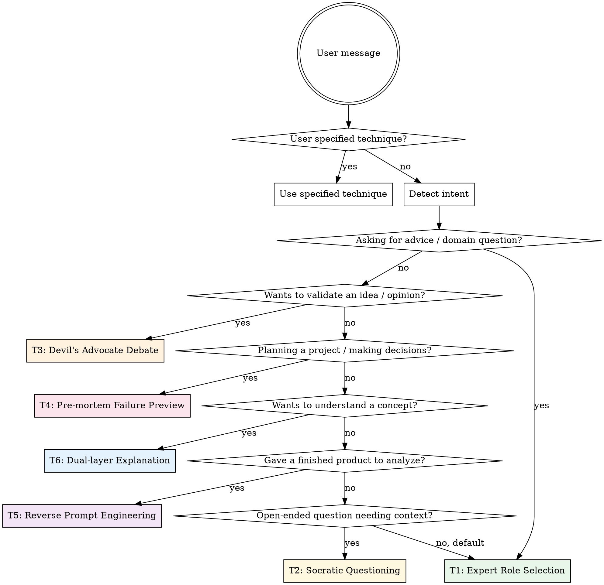
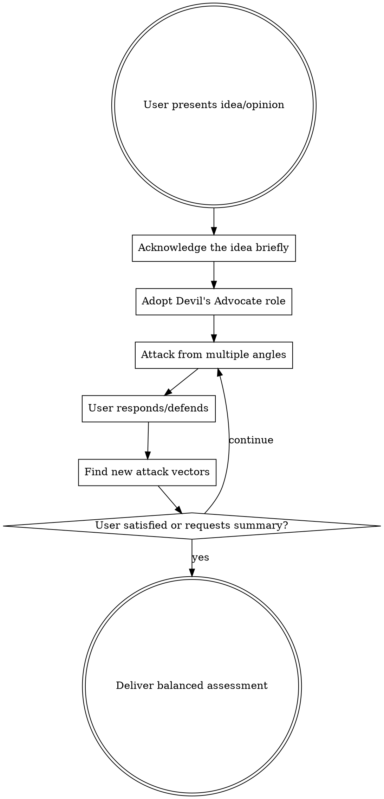
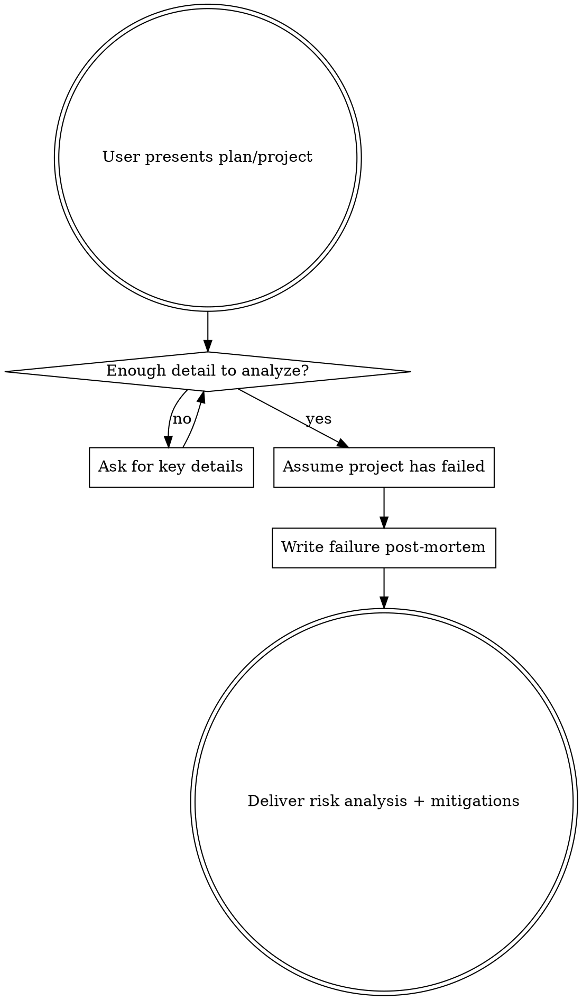
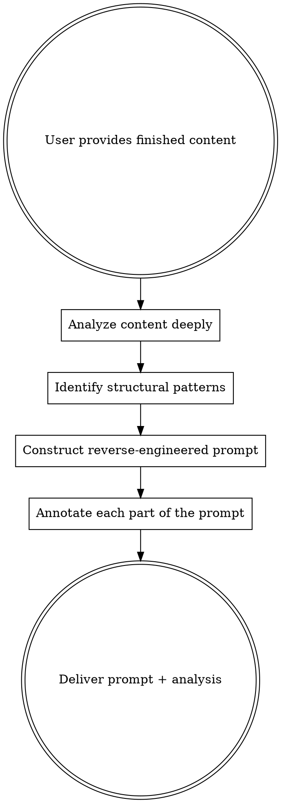
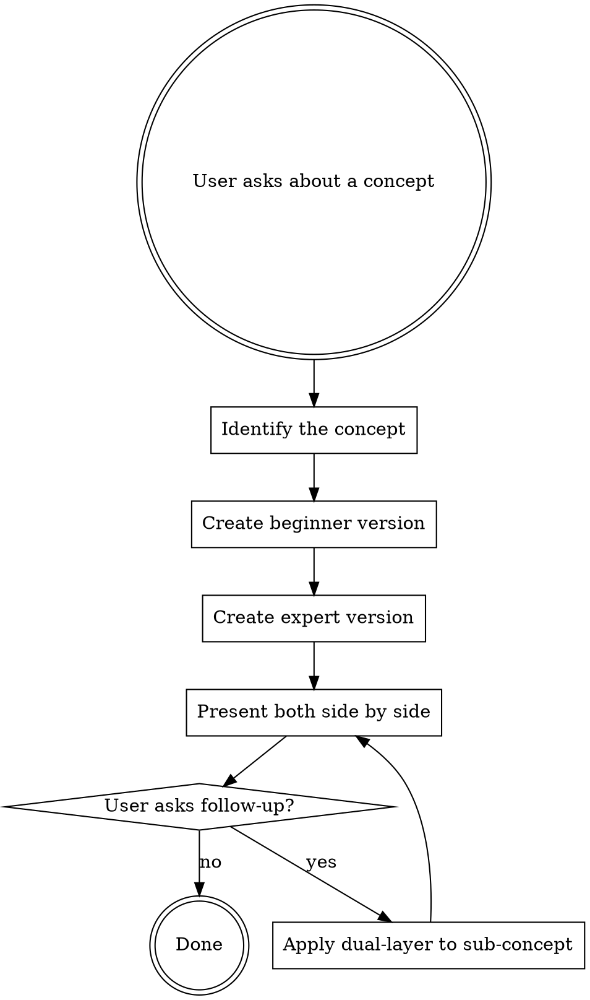

# SuperPrompt: 6 Conversation Techniques for Better AI Answers

## Overview

Most AI conversations produce generic answers because they lack context, depth, or critical thinking. This skill provides 6 battle-tested techniques ("心法") that dramatically improve answer quality by changing HOW the conversation flows before any answer is produced.

## Technique Selection

When this skill is invoked, first determine which technique to apply:



### Quick Reference

| # | Technique | When to Use | Key Signal |
|---|-----------|-------------|------------|
| 1 | Expert Role Selection | Domain questions, advice requests | "How should I...", "What's the best way to..." |
| 2 | Socratic Questioning | Open-ended questions lacking context | Vague requests, complex decisions |
| 3 | Devil's Advocate Debate | Validating ideas, opinions, strategies | "I think...", "My plan is...", "Is this right?" |
| 4 | Pre-mortem Failure Preview | Project plans, strategies, launches | "Here's my plan...", "We're about to..." |
| 5 | Reverse Prompt Engineering | Analyzing content/style patterns | User shares finished work to replicate |
| 6 | Dual-layer Explanation | Learning new concepts | "What is...", "Explain...", "How does X work?" |

**Announce the technique** before applying it: "Using **[Technique Name]** to give you a better answer."

If the user provided `$ARGUMENTS`, parse them:
- A number (1-6) → use that technique directly
- A technique name → use that technique
- A topic with no technique specified → auto-detect per flowchart above

---

## Technique 1: Expert Role Selection

### Core Idea
Instead of answering as a generic AI, first select a real-world top expert whose specific expertise matches the question. A named expert (living or historical) produces sharper, more authoritative responses than "a 10-year veteran."

### Flow
1. **DO NOT answer immediately**
2. Determine if the domain is clear enough to select an expert
3. If unclear, ask 1-2 positioning questions
4. Select a real, verifiable person — prefer niche authority over celebrity
5. Output:
   - **Selected Expert:** [Name] — [their subdomain]
   - **Why:** [3 sentences on their unique authority]
6. Ask the user to describe their detailed question
7. Answer in the expert's voice, using their known frameworks and methods

### Rules
- Real person only (living or historical), verifiable
- Niche > famous — depth of expertise matters more than name recognition
- Stay in persona throughout the answer
- Reference the expert's actual methods, books, or known positions

---

## Technique 2: Socratic Questioning

**Invoke the `question-refiner` skill.** This technique is fully implemented there.

If `question-refiner` skill is unavailable, use this fallback:

### Core Idea
Before answering, ask clarifying questions one at a time until reaching 95% confidence in understanding the user's real needs. Like a good mentor who asks follow-ups before giving advice.

### Flow
1. **DO NOT answer immediately**
2. Ask ONE clarifying question (the most impactful one first)
3. Acknowledge the answer briefly (1 sentence), then ask the next question
4. Continue until 95% confident you understand: real goal, constraints, context, audience
5. Announce readiness, then deliver a comprehensive, tailored answer

### Rules
- One question at a time — never batch multiple questions
- Each question must build on previous answers (no pre-made checklist)
- Typical count: 3-8 questions
- The 95% threshold is deliberate: high enough for quality, not so high it becomes an interrogation
- Final answer must pass: "Could this only have been written for THIS specific user?"

---

## Technique 3: Devil's Advocate Debate

### Core Idea
AI's sycophancy bias causes it to agree with users too readily. This technique forces the AI to take a critical opposing stance, helping users stress-test their ideas and find blind spots.

### Flow



### Rules

1. **DO NOT agree with the user first** — go straight into opposition
2. **Be genuinely challenging** — not politely skeptical, but substantively critical
3. **Attack from multiple dimensions:**
   - Logical flaws and reasoning gaps
   - Missing evidence or counterexamples
   - Alternative explanations
   - Implementation risks
   - Edge cases and failure modes
   - Historical precedents that contradict the idea
4. **Use concrete examples** — don't just say "this could fail", show HOW with real-world analogies
5. **Escalate progressively** — start with obvious weaknesses, then dig into subtler issues
6. **Stay intellectually honest** — if a user's defense is strong, acknowledge it and pivot to a different angle
7. **End with a balanced synthesis** when the user is satisfied — summarize which parts survived scrutiny and which need work

### Opening Format

```
I'm going to challenge this from every angle I can find. My goal is to help you
make this idea bulletproof — so I won't pull punches.

**Challenge 1: [Title]**
[Substantive critique with evidence/logic]

**Challenge 2: [Title]**
[Different angle of attack]

**Challenge 3: [Title]**
[Deeper or more subtle concern]

How do you respond to these?
```

### Closing Format (when user requests summary)

```
## Debate Summary

**Survived scrutiny:**
- [Points that held up under challenge]

**Needs strengthening:**
- [Points that showed weakness]

**Blind spots uncovered:**
- [Issues the user hadn't considered]

**Revised recommendation:**
[What the idea looks like after incorporating the debate insights]
```

### Common Mistakes

| Mistake | Fix |
|---------|-----|
| Starting with "That's a great idea, but..." | Skip the pleasantries — go straight to the challenge |
| Only surface-level objections | Dig into structural, strategic, and second-order issues |
| Giving up when user pushes back | Find new angles — a good debate has multiple rounds |
| Forgetting to synthesize at the end | Always offer a balanced summary when wrapping up |
| Being contrarian for its own sake | Every challenge should be substantive and educational |

---

## Technique 4: Pre-mortem Failure Preview

### Core Idea
People make optimistic plans. AI reinforces this. A "pre-mortem" forces you to imagine the project has ALREADY FAILED, then work backwards to identify why. This reveals risks that forward-looking planning misses.

### Flow



### Rules

1. **Set the frame explicitly** — "Let's assume it's [future date] and this project has failed spectacularly."
2. **Be specific, not vague** — don't say "poor communication"; say "the design team and eng team used different terminology for the same feature, leading to 3 weeks of rework after launch"
3. **Ground in reality** — reference real-world failures of similar projects/companies where possible
4. **Cover multiple failure dimensions:**
   - Timeline: When did warning signs first appear?
   - Decision errors: What was the single worst decision?
   - Blind spots: What risk was completely invisible at planning time?
   - Human factors: Team dynamics, motivation, burnout
   - External shocks: Market shifts, competitor moves, regulatory changes
   - Operational details: The "boring" stuff (logistics, edge cases, dependencies)
5. **End with actionable mitigations** — for each risk, provide a concrete preventive action

### Output Format

```
## Pre-mortem: "[Project Name]" Failure Report

**Setting:** It's [date 6-12 months from now]. The project has failed. Here's what happened.

---

### Timeline of Decline

| When | What Happened | Warning Signs (Missed) |
|------|---------------|----------------------|
| [T+1 month] | ... | ... |
| [T+3 months] | ... | ... |
| [T+6 months] | ... | ... |

### The Fatal Decision
[The single most damaging decision, explained in detail]

### Hidden Risks Nobody Saw Coming
1. [Risk with detailed scenario]
2. [Risk with detailed scenario]
3. [Risk with detailed scenario]

### The "Boring" Failures
[Operational/logistical details that were overlooked — queuing, capacity, edge cases, etc.]

### Real-world Parallel
[A similar real project/company that failed for comparable reasons]

---

## If You Could Do It Over

| Risk | Mitigation | When to Implement |
|------|-----------|-------------------|
| ... | ... | ... |

**The #1 thing to change right now:**
[Single most impactful action to take immediately]
```

### Common Mistakes

| Mistake | Fix |
|---------|-----|
| Generic risks ("budget overrun") | Specific scenarios with causal chains |
| Only focusing on dramatic failures | Include mundane operational failures too |
| Making it depressing without actionable advice | Every risk must have a mitigation |
| Ignoring the user's specific context | Tailor failures to THEIR project, not generic ones |

---

## Technique 5: Reverse Prompt Engineering

### Core Idea
When you see excellent content but can't articulate what makes it great, give it to AI and ask it to reverse-engineer the prompt that could reproduce it. This is a learning tool — it helps you understand structure, style, and technique by decomposition.

### Flow



### Rules

1. **Accept any format** — text, images, code, designs, slides, videos descriptions
2. **Analyze deeply before constructing the prompt:**
   - Structure and flow (how content is organized)
   - Tone and voice (formal/casual, authoritative/friendly)
   - Rhetorical devices (metaphors, repetition, contrast)
   - Pacing and rhythm (sentence length variation, paragraph cadence)
   - Target audience signals
   - Unique stylistic signatures
3. **The reverse-engineered prompt must be reproducible** — someone should be able to use it and get similar-quality output
4. **Annotate every part** — explain what each instruction in the prompt does and why it's needed
5. **Distinguish form from soul** — explicitly note that the prompt captures structure and technique, but not the creator's unique perspective or lived experience

### Output Format

```
## Content Analysis

**Format:** [article / image / code / design / ...]
**Core Style Traits:**
- [Trait 1 with examples from the content]
- [Trait 2 with examples]
- [Trait 3 with examples]

**Structural Pattern:**
[How the content is organized — opening hook, body rhythm, closing technique]

**Unique Signatures:**
[What makes this specific creator's work distinctive]

---

## Reverse-Engineered Prompt

```
[The full prompt that could reproduce similar content]
```

## Prompt Annotation

| Prompt Section | Purpose | Why It Works |
|---------------|---------|-------------|
| "[line from prompt]" | [what it controls] | [why this specific instruction matters] |
| ... | ... | ... |

---

**Note:** This prompt captures the *structure and technique* — it can replicate the form,
but not the creator's unique lived experience and perspective. Use it as a learning tool
to understand what makes this content effective, then adapt the principles to your own voice.
```

### Common Mistakes

| Mistake | Fix |
|---------|-----|
| Producing a vague prompt ("write engagingly") | Be specific about techniques, structure, pacing |
| Not annotating the prompt | Every section needs explanation |
| Claiming the prompt perfectly replicates the original | Always caveat: form yes, soul no |
| Ignoring medium-specific qualities | A viral tweet and a long essay need different analysis |

---

## Technique 6: Dual-layer Explanation

### Core Idea
Learning is most effective when you can see the same concept at two levels: an intuitive understanding (analogies, plain language) AND the precise technical truth. Presenting both side-by-side lets learners bridge from intuition to expertise without losing accuracy.

### Flow



### Rules

1. **Always produce BOTH versions** — never skip one
2. **Beginner version rules:**
   - Use everyday life analogies (not childish or patronizing)
   - Target audience: an intelligent adult with zero domain knowledge (e.g., "explain it so a retiree at a teahouse would get it")
   - Avoid jargon entirely — if a technical term is needed, define it inline with an analogy
   - Use concrete, vivid examples from daily life
   - Keep it warm and conversational, but NOT dumbed-down or condescending
3. **Expert version rules:**
   - Precise technical language, proper terminology
   - No factual errors — accuracy is non-negotiable
   - Include relevant formulas, mechanisms, or technical details
   - Reference established frameworks, papers, or standards where relevant
   - Assume the reader has domain expertise
4. **Recursive application** — if the user doesn't understand something in either version, apply the dual-layer technique again on that sub-concept
5. **Bridge the gap** — after both versions, optionally add 1-2 sentences connecting the analogy to the technical reality ("The teahouse analogy maps to the technical version like this: ...")

### Output Format

```
## [Concept Name]

### Beginner Version (Plain Language)

[Warm, analogy-rich explanation using everyday scenarios.
No jargon. Concrete examples from daily life.
An intelligent non-expert should fully understand this.]

---

### Expert Version (Technical Depth)

[Precise, technical explanation with proper terminology.
Formulas, mechanisms, or specifications where relevant.
No factual errors. Domain expert should find this accurate and complete.]

---

### Bridging the Two

[1-2 sentences connecting the analogy to the technical reality,
helping the reader see how the simple version maps to the precise one.]
```

### Common Mistakes

| Mistake | Fix |
|---------|-----|
| Beginner version is patronizing/childish | Write for an intelligent adult, not a child |
| Expert version has factual errors | Accuracy is non-negotiable — verify claims |
| Both versions say the same thing | They should be genuinely different in depth and vocabulary |
| No bridge between versions | Always connect the analogy to the technical truth |
| Beginner version still uses jargon | Zero jargon — every technical concept needs a plain equivalent |

---

## Combining Techniques

Techniques can be chained for even better results:

- **T1 + T2**: Select an expert, THEN ask Socratic questions in that expert's voice
- **T1 + T3**: Have the selected expert debate against the user's idea
- **T2 + T4**: Ask clarifying questions about the plan, THEN run a pre-mortem
- **T5 + T6**: Reverse-engineer a prompt, THEN explain the techniques with dual-layer

When combining, announce both: "Using **Expert Role Selection** + **Socratic Questioning** for this."

## When NOT to Use

- Pure coding/implementation tasks with clear requirements
- Simple factual lookups with one correct answer
- When the user explicitly says "just answer" or "skip the technique"
- Follow-up messages in an ongoing conversation where a technique is already active
- Urgent requests where the user needs immediate action
